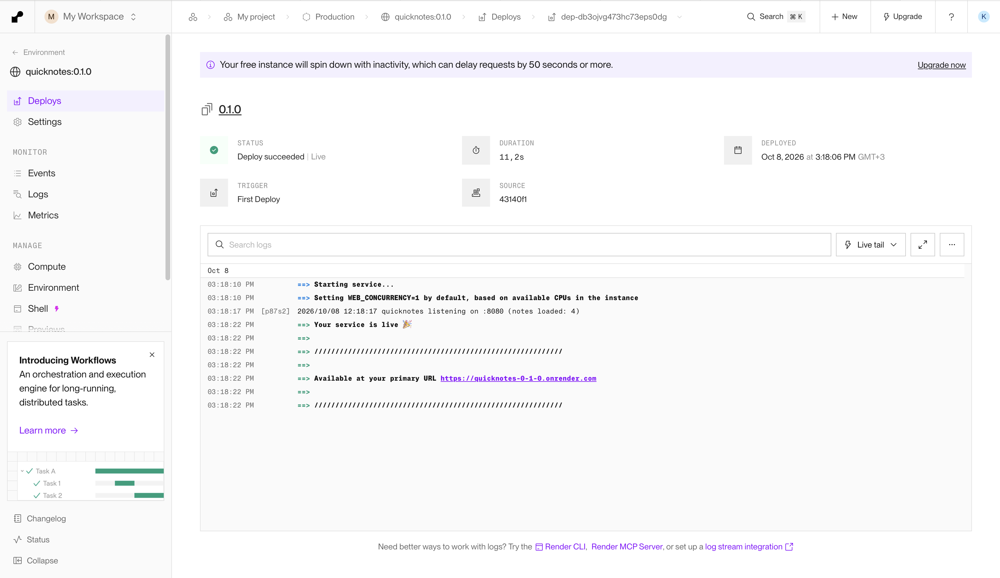
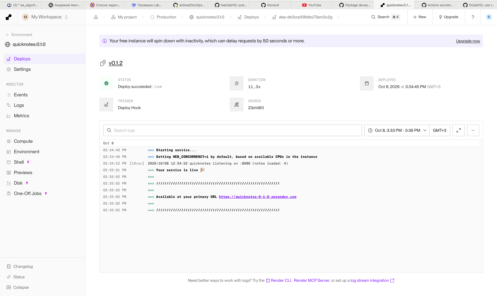

# Lab 10 submission

Task 2 was done on **Render**, Option A. Render accepted the free plan without
asking to verify a card, so the Codespaces fallback was not needed.

## Task 1: CI-automated push to ghcr.io

Workflow: [.github/workflows/release.yml](../.github/workflows/release.yml)

```yaml
name: Release

on:
  push:
    tags:
      - "v*"

permissions:
  contents: read

env:
  REGISTRY: ghcr.io
  IMAGE_NAME: ${{ github.repository }}/quicknotes

jobs:
  publish:
    name: build and push to ghcr.io
    runs-on: ubuntu-24.04
    permissions:
      contents: read
      packages: write
    env:
      RENDER_DEPLOY_HOOK: ${{ secrets.RENDER_DEPLOY_HOOK }}

    steps:
      - uses: actions/checkout@d23441a48e516b6c34aea4fa41551a30e30af803  # v6.1.0

      - name: Set up Buildx
        uses: docker/setup-buildx-action@f87e5991a6d7451dcb8d9637bfbc97413f497069  # v4.4.1

      - name: Log in to ghcr.io
        uses: docker/login-action@dbcb813823bdd20940b903addbd779551569679f  # v4.6.0
        with:
          registry: ${{ env.REGISTRY }}
          username: ${{ github.actor }}
          password: ${{ secrets.GITHUB_TOKEN }}

      - name: Work out the tags
        id: meta
        uses: docker/metadata-action@dc802804100637a589fabce1cb79ff13a1411302  # v6.2.0
        with:
          images: ${{ env.REGISTRY }}/${{ env.IMAGE_NAME }}
          flavor: |
            latest=false
          tags: |
            type=semver,pattern={{raw}}
            type=semver,pattern={{version}}
            type=raw,value=latest

      - name: Build and push
        id: push
        uses: docker/build-push-action@c3c9e263c25d99ce0380d002d59b67737d91b0dc  # v7.4.0
        with:
          context: ./app
          platforms: linux/amd64
          push: true
          tags: ${{ steps.meta.outputs.tags }}
          labels: ${{ steps.meta.outputs.labels }}
          cache-from: type=gha
          cache-to: type=gha,mode=max
```

All five third-party actions are pinned by 40 character commit SHA. The job
takes `packages: write` and nothing else, on top of a workflow that starts at
`contents: read`.

The build is pinned to `linux/amd64`. Render runs amd64, the runner is amd64 as
well, so this needs no emulation and the image cannot end up arm64 only.

### Registry

The image lives at `ghcr.io/aniksel/devops-intro/quicknotes`, and the package is
public. Each tag publishes three names: the tag as pushed, the bare semver, and
`latest`.

Clean pull with no credentials at all:

```
$ docker logout ghcr.io
Removing login credentials for ghcr.io

$ docker rmi ghcr.io/aniksel/devops-intro/quicknotes:v0.1.2
$ docker pull --platform linux/amd64 ghcr.io/aniksel/devops-intro/quicknotes:v0.1.2
v0.1.2: Pulling from aniksel/devops-intro/quicknotes
2c6957ee8643: Pull complete
c12687000c24: Pull complete
d643d5b807cd: Pull complete
c6b004c83ca4: Pull complete
44136fa355b3: Already exists
d5cf6f80c60b: Download complete
Digest: sha256:5b837a02c1538d66fe0bbfe7e0db5b38da40f158ed238ce3cbf8d0283ad72948
Status: Downloaded newer image for ghcr.io/aniksel/devops-intro/quicknotes:v0.1.2

$ docker image inspect ghcr.io/aniksel/devops-intro/quicknotes:v0.1.2 \
    --format '{{.Os}}/{{.Architecture}} user={{.Config.User}} entrypoint={{.Config.Entrypoint}}'
linux/amd64 user=65532:65532 entrypoint=[/quicknotes]
```

The platform is given explicitly because the laptop is arm64 and the image is
built for amd64 only.

### Green release run

https://github.com/aniksel/DevOps-Intro/actions/runs/37777656495

Tag `v0.1.2`, status success, 1m 57s. It built the image, pushed three tags, and
called the Render deploy hook.

### Design questions

**a) OIDC versus GITHUB_TOKEN**

`GITHUB_TOKEN` is enough here because the registry and the repository belong to
the same account, and ghcr.io accepts that token directly. The token is made for
the run, limited by the `permissions` block, and dies when the job ends.

OIDC is for a target outside GitHub. A push to AWS ECR, to Google Artifact
Registry or to Azure cannot be authorised by `GITHUB_TOKEN`. The old answer was
to store a long-lived access key as a repository secret, and that key then sits
there until somebody remembers to rotate it.

OIDC replaces the stored key. The job asks GitHub for a short-lived signed token
that states which repository, which branch or tag, and which workflow is
running. The cloud provider checks the signature and exchanges it for
credentials that live for minutes.

Three things that buys:

- there is no long-lived secret in the repository at all
- the provider's trust policy can name one repository and one workflow, so a
  stolen workflow file is not enough on its own
- every exchange is logged on the provider side

**b) Why ship `latest` next to an immutable tag**

The immutable tag is the one that runs. `v0.1.2` means one digest forever, so a
deploy, a rollback and a Lab 9 scan all point at the same bytes.

`latest` is for people and for tools that do not know a version number. Someone
following the README and running `docker pull .../quicknotes` gets a working
image instead of an error. A demo, a smoke test or a link in a chat does not
have to be edited on every release.

The rule is where each one may be used. `latest` is fine in documentation and on
a laptop. It does not belong in a deployment. Two machines that pulled on
different days would run different code, and nothing in the configuration would
say so. The Render service here is pinned to a version tag, and the deploy hook
moves it from one version to the next.

**c) Why only `packages: write`**

The principle is least privilege: a job gets the rights its own work needs and
nothing more.

With `write: all` the same token could also push commits, move tags, open and
merge pull requests, edit releases and write to the Actions cache. This job only
has to push an image.

The attack the narrow scope prevents is a compromised step. A third-party action,
or anything it pulls in, runs with the same token as the rest of the job.

With `packages: write` the worst it can do is publish a bad image. That is
visible in the registry and can be deleted. With `contents: write` it could push
a commit to the default branch, or move `v0.1.2` onto a commit of its own. The
next release would then build that code, and no pull request would show it.

---

## Task 2: Deploy to Render

Service URL: **https://quicknotes-0-1-0.onrender.com**

Configuration: [cloud/render.md](../cloud/render.md).
Teardown: [cloud/teardown.md](../cloud/teardown.md).
Measurement script: [cloud/measure.sh](../cloud/measure.sh),
raw output: [cloud/latency.txt](../cloud/latency.txt).

Source is the **existing image** from Task 1, not a build by Render. The reason
is in question (f).

### The service answers

```
$ curl -v https://quicknotes-0-1-0.onrender.com/health
> GET /health HTTP/2
> Host: quicknotes-0-1-0.onrender.com
>
< HTTP/2 200
< date: Thu, 08 Oct 2026 12:23:31 GMT
< content-type: application/json
< rndr-id: 99c7aa83-c348-4b4c
< server: cloudflare
< x-render-origin-server: Render
< cf-ray: a4751e04fd806718-AMS
<
{"notes":4,"status":"ok"}

$ curl -s https://quicknotes-0-1-0.onrender.com/notes | head -c 160
[{"id":1,"title":"Welcome to QuickNotes","body":"This is the project you'll containerize, deploy, monitor, and harden across all 10 labs."
```

### The port, from the deploy log

```
03:34:49 PM  ==> Starting service...
03:34:49 PM  ==> Setting WEB_CONCURRENCY=1 by default, based on available CPUs in the instance
03:34:52 PM  [l6vsc] 2026/10/08 12:34:52 quicknotes listening on :8080 (notes loaded: 4)
03:35:01 PM  ==> Your service is live
03:35:02 PM  ==> Available at your primary URL https://quicknotes-0-1-0.onrender.com
```

The log goes straight from the listening line to `Your service is live`. There
is no `New primary port detected` and no second deploy, because `PORT` and
`ADDR` were set to `8080` before the first boot.



### Deploy from CI

The last step of the release workflow calls the service deploy hook:

```yaml
      - name: Redeploy Render
        if: env.RENDER_DEPLOY_HOOK != ''
        env:
          IMAGE: ${{ fromJSON(steps.meta.outputs.json).tags[0] }}
        run: |
          set -euo pipefail
          encoded="$(printf '%s' "$IMAGE" | jq -sRr @uri)"
          code="$(curl -sS -o /dev/null -w '%{http_code}' "${RENDER_DEPLOY_HOOK}&imgURL=${encoded}")"
          echo "deploy hook returned HTTP $code for $IMAGE"
          test "$code" = "200"
```

The hook URL carries a secret key, so it is stored as the GitHub Actions secret
`RENDER_DEPLOY_HOOK` and never appears in the repository. `imgURL` has to be
percent encoded, and only the tag may differ from the image the service was
created with. The image name comes from the metadata action rather than being
built by hand. A registry name has to be lowercase and `github.repository` is
not, and Render answers HTTP 400 if the name differs by even a letter case.

Pushing tag `v0.1.2` produced this deploy, triggered by the hook and not by a
human:



### Scale to zero

Free services spin down after 15 idle minutes. Each cold sample below was taken
after 21 minutes without a single request.

| Measurement | Value |
|---|---|
| Warm p50, 10 consecutive requests | **0.31 s** |
| Warm slowest of the 10 | 0.48 s |
| Cold start 1 | **12.83 s** |
| Cold start 2 | **13.74 s** |
| Cold start 3 | **14.15 s** |

A cold request is about 44 times slower than a warm one.

```
== warm again, 10 consecutive requests right after the last wake ==
  warm  1: 0.308065s     warm  6: 0.326101s
  warm  2: 0.312072s     warm  7: 0.478431s
  warm  3: 0.308578s     warm  8: 0.308757s
  warm  4: 0.302817s     warm  9: 0.274270s
  warm  5: 0.427828s     warm 10: 0.281721s
```

The first warm block in `cloud/latency.txt` was taken on a service that had been
idle for hours, so its first request was itself a cold start. The block above
was taken right after a wake, while the instance was certainly warm, and it is
the one the p50 comes from.

### What happened to the note

```
== write a note, then let the service spin down ==
  POST /notes -> {"id":5,"title":"before spin down","body":"does this survive",...}
  present now: 1 (1 = yes, 0 = no)

== idle 1260s, then cold request #1 ==
  cold 1:        12.832329s
  health:         {"notes":4,"status":"ok"}
  note survived:  0 (1 = yes, 0 = no)

== idle 1260s, then cold request #2 ==
  cold 2:        13.735607s
  note survived:  0

== idle 1260s, then cold request #3 ==
  cold 3:        14.153117s
  note survived:  0
```

The note was written, confirmed present, and gone after every one of the three
spin-downs. `/health` reports `notes: 4` again each time, which is the seed file
and nothing else.

### Design questions

**d) Render spin-down versus Cloud Run scale to zero**

The same idea with very different numbers. Measured here: 12.8, 13.7 and 14.2
seconds for the first request after a spin-down. Cloud Run normally answers a
cold request in a few hundred milliseconds, sometimes a couple of seconds.

The difference is how much has to be restored. Render stops the container and
keeps nothing hot. Waking it means scheduling the workload, unpacking the image,
starting the container, starting the process, and only then answering. Cloud Run
keeps image layers staged next to its workers. It starts containers in a sandbox
built for fast start, and it holds an instance warm for a while before releasing
it.

They optimise for different things. Render optimises for a free tier that costs
it nothing while nobody is looking, and for a product where you push an image
and get a URL. Cloud Run optimises for request latency. It is a paid serverless
runtime billed per request, and cold start is the complaint its customers care
about most. Render is open about its own trade: the dashboard says a free
instance "can delay requests by 50 seconds or more".

**e) Why Render injects `PORT` instead of reading `EXPOSE`**

`EXPOSE` is a label inside the image. Nothing enforces it: a container may
listen on any port no matter what the Dockerfile says, and the value can be
stale or simply wrong. Render would be trusting a claim. Telling the container
which port to use, and then watching which port actually gets opened, is a fact
instead. Heroku, Cloud Run and most platforms of this shape use the same
convention.

Set here: `PORT=8080` and `ADDR=:8080`. QuickNotes reads `ADDR` and already
defaults to `:8080`, so the second variable exists to make the pair explicit and
stop the two from drifting apart silently.

A mismatch costs a second deploy. Render brings the service up and sees the
process listening somewhere other than `PORT`. It logs `New primary port
detected` and restarts the deploy with the corrected port. That adds roughly 45
seconds to every deploy with the problem. The log above has no such line.

**f) Existing image versus letting Render build, and where the note went**

Running the image CI built means the thing serving traffic is the exact artifact
Lab 9 scanned with Trivy and ZAP, down to the digest. The build happens once, on
a runner with a layer cache, instead of being repeated on a small free instance.
And the tag is immutable, so a rollback is a tag change rather than a rebuild of
whatever the branch holds today. The cost is one more moving part. The registry
has to be reachable and the package public, and a failed CI run means no new
image at all.

Letting Render build from the repository is simpler to set up, and it removes
the registry from the path. What it gives up is the three things above:

- the running image is built by a different machine from the one that was scanned
- the build repeats on every deploy
- "the current state of the branch" is not a version anyone can point at

The note went nowhere, and that is the lesson. A free Render instance has an
ephemeral filesystem. When the container stops, everything written inside it is
discarded. The next start begins from the image again, which is why the four
seeded notes come back untouched every time. QuickNotes keeps its notes in a
file inside the container, so the only data that survives a spin-down is the data
baked into the image. Keeping user data would need storage outside the
container, a managed database or a persistent disk, and the free plan has
neither.
