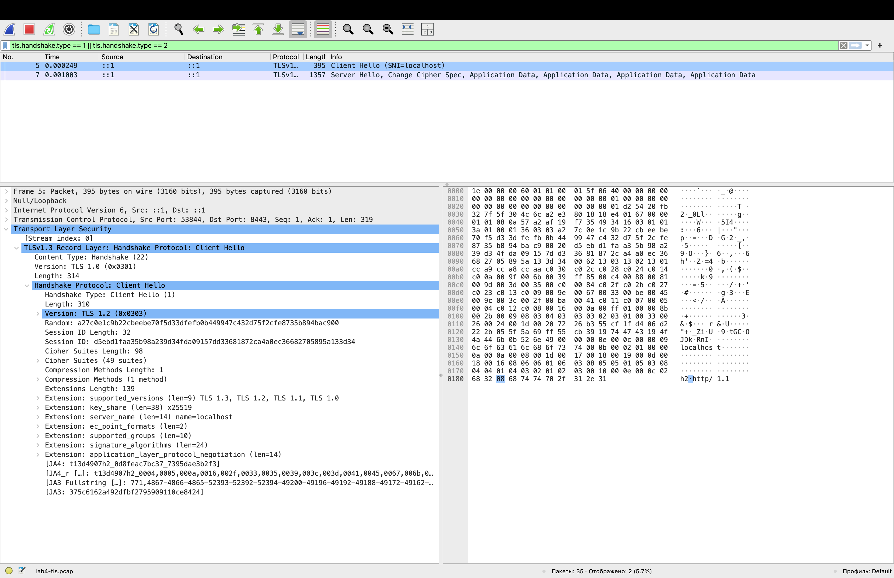
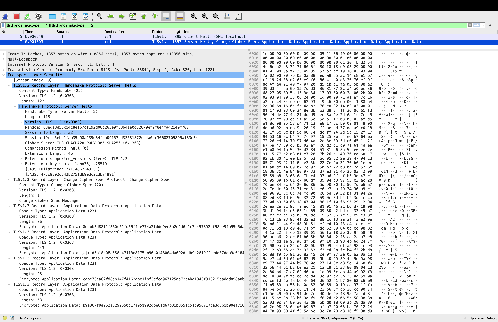

# Lab 4 submission

Everything was done on macOS, which the lab lists as a supported platform. A few commands in the task text exist only on Linux, so I used the macOS equivalent:

| Task text | Used here |
|---|---|
| `ss -tlnp` | `lsof -nP -iTCP:8080 -sTCP:LISTEN` |
| `ip route show` | `netstat -rn` |
| `journalctl --user -u quicknotes` | `log show --predicate ...` |
| `iptables -L` / `nft list ruleset` | `pfctl -s rules` |
| interface `lo` | interface `lo0` |

---

## Task 1: Trace a Request End-to-End

### 1.1: Capture

```bash
sudo tcpdump -i lo0 -nn -s 0 -A 'tcp port 8080' -w /tmp/lab4-trace.pcap
curl -v -X POST http://localhost:8080/notes \
  -H 'Content-Type: application/json' \
  -d '{"title":"trace me","body":"in flight"}'
```

12 packets were captured, which is the whole conversation from open to close. Full decode: [`lab4-trace.txt`](lab4-trace.txt).

What curl showed on the client side:

```
* Host localhost:8080 was resolved.
* IPv6: ::1
* IPv4: 127.0.0.1
*   Trying [::1]:8080...
* Connected to localhost (::1) port 8080
> POST /notes HTTP/1.1
> Content-Type: application/json
> Content-Length: 39
< HTTP/1.1 201 Created
< Content-Type: application/json
< Content-Length: 90
{"id":6,"title":"trace me","body":"in flight","created_at":"2026-09-14T13:35:59.267622Z"}
```

`localhost` resolved to both `::1` and `127.0.0.1`, and curl picked IPv6, so the whole exchange runs over IPv6 on the loopback.

### 1.2: Annotated trace

| # | Direction | Flags | What it is |
|---|---|---|---|
| 1 | client 57398 to server 8080 | `[S]` | SYN, client opens the connection |
| 2 | server to client | `[S.]` | SYN/ACK, server accepts |
| 3 | client to server | `[.]` | ACK, three-way handshake complete |
| 4 | server to client | `[.]` | ACK, server side of the socket settles |
| 5 | client to server | `[P.]` len 174 | `POST /notes HTTP/1.1` with headers and the JSON body |
| 6 | server to client | `[.]` | ACK of the request bytes |
| 7 | server to client | `[P.]` len 203 | `HTTP/1.1 201 Created` with the JSON response |
| 8 | client to server | `[.]` | ACK of the response bytes |
| 9 | client to server | `[F.]` | FIN, client starts closing |
| 10 | server to client | `[.]` | ACK of the FIN |
| 11 | server to client | `[F.]` | FIN, server closes its side |
| 12 | client to server | `[.]` | ACK, connection fully closed |

Packets 1 to 3 are the handshake, 5 and 7 carry the entire HTTP exchange (request and response each fit in a single segment), and 9 to 12 are the four-way close. On loopback the whole thing took under a millisecond.

### 1.3: Five debugging commands

Output in [`lab4-commands.txt`](lab4-commands.txt). Why each one:

**1. What is listening.** Answers the first question behind any "it does not respond": is there a socket at all. It showed `quicknotes` PID 49068 bound to `*:8080` over IPv6, which is why curl reached it at `::1`.

**2. Routes.** Shows where packets for a destination would actually go. It also showed that this machine's default route runs through a VPN interface (`utun6`).

**3. Reachability.** `mtr -rwc 5 localhost` reported one hop, 0% loss, 0.2 ms. On loopback that is trivially healthy, but the same command against a real host separates "the service is down" from "the network between us is down".

**4. DNS.** `dig +short example.com @1.1.1.1` resolved normally. Asking a specific resolver instead of the system one separates "name resolution is broken" from "my configured resolver is broken".

**5. Logs.** There is no systemd on macOS, and QuickNotes runs in a terminal rather than as a managed service, so the system log has no entries for it. Its output goes to the terminal that started it.

### 1.4: What I would check first on a 502

A 502 means a proxy in front of the service got no usable answer from upstream, so the proxy is alive and the question is which side of it is broken. I would first bypass the proxy and curl the application directly on its own port: if that returns 200, the fault is in the proxy config, not the service. Then I would check that something is listening where the proxy thinks it is, and compare that bind address to the upstream address in the proxy config. This trace shows why that matters: QuickNotes bound to `*:8080` and curl chose IPv6, so a proxy dialling `127.0.0.1:8080` still works, but a service bound only to `::1` would give an IPv4-only proxy a connection refused and produce exactly this 502. After that, timing: a 502 that arrives after a suspiciously round number of seconds is usually the proxy's read timeout, which means the service is slow rather than dead, and the search moves to the application logs and to whatever it is waiting on.

---

## Task 2: Outside-In Debugging on a Broken Deploy

### 2.1: Reproducing the break

With one instance already holding the port, a second one was started the same way:

```bash
cd app/
ADDR=:8080 go run .
```

```
2026/09/14 16:47:09 quicknotes listening on :8080 (notes loaded: 6)
2026/09/14 16:47:09 listen: listen tcp :8080: bind: address already in use
exit status 1
```

The service prints that it is listening before it has actually bound, so the first line claims success and the second one contradicts it.

### 2.2: The outside-in chain

Full output in [`lab4-outside-in.txt`](lab4-outside-in.txt).

| Step | Command | Result | Decision |
|---|---|---|---|
| 1. Is it running? | `ps -ef \| grep -E "quicknotes\|go run"` | Two processes: `go run .` (49052) and the binary it compiled, `quicknotes` (49068) | Something runs, but which one owns the port is still unknown |
| 2. Is it listening? | `lsof -nP -iTCP:8080 -sTCP:LISTEN` | One socket, PID 49068, `*:8080`, IPv6 | Exactly one process owns the port, so the second instance never got it |
| 3. Does it answer? | `curl -s -o /dev/null -w "%{http_code}" .../health` | `200` | The service is healthy, this is not an application fault |
| 4. Firewall? | `sudo pfctl -s rules` | Only Apple's default anchors, no blocking rules | Not a filtering problem |
| 5. Name resolution? | `dig +short localhost` and `dscacheutil -q host -a name localhost` | `dig` timed out, `dscacheutil` returned `127.0.0.1` and `::1` | Not a resolution problem either |

Two things are worth pulling out of that table.

`go run .` does not serve anything itself. It compiles the module to a temporary binary and runs that, so the parent process and the process holding the socket are different PIDs. Killing the wrapper and expecting the port to free up is an easy way to lose ten minutes.

In step 5, `dig` timed out while the system resolver answered instantly. Nothing is broken: `localhost` comes from `/etc/hosts` and never touches DNS, and `dig` skips that path by design and queries a nameserver, which on this machine is unreachable behind the VPN seen in the routing table. A debugging step is only useful if you know which layer it actually exercises.

**Root cause:** `listen tcp :8080: bind: address already in use`. A second instance was started while the first still held the port, and the kernel refused the bind.

### 2.3: Repair and re-verify

The first instance was stopped, then the second was started again and verified:

```
$ curl -s http://localhost:8080/health | jq
{
  "notes": 6,
  "status": "ok"
}

$ lsof -nP -iTCP:8080 -sTCP:LISTEN
quicknote 53336 annaksel    5u  IPv6 ...  TCP *:8080 (LISTEN)
```

The PID changed from 49068 to 53336, which confirms the new process owns the port rather than the old one still answering.

### 2.4: Mini-postmortem

A second QuickNotes instance was started while the first still held `:8080`, and it exited immediately with `bind: address already in use`. Nothing was lost. The original instance kept serving and `/health` returned 200 throughout.

What is systemic here is not that someone started a process twice. Port ownership is invisible state: the only way to know that `:8080` is taken is to ask the kernel, and nothing in `go run .` asks first. The failure is also silent from the outside. Every step of the outside-in chain passed, because those checks describe the port, not the process that intended to own it. Monitoring watching `/health` would have shown green while a deploy had in fact failed, and the service's own first log line claimed success before the bind was attempted.

Tooling that would prevent it: a process supervisor such as systemd, launchd or a container runtime that owns the port and refuses to start a duplicate unit; a deploy that stops the old instance before starting the new one; and a readiness check tied to the identity of the new process rather than to the port, so that "something answers" is never mistaken for "my deploy succeeded".

---

## Bonus Task: Decode the TLS Handshake

### B.1: HTTPS in front of QuickNotes

Caddy was installed with Homebrew and run in the foreground with a local config, since macOS has no systemd:

```
localhost:8443 {
  reverse_proxy localhost:8080
}
```

```bash
caddy run --config /tmp/Caddyfile --adapter caddyfile
```

Caddy issued a certificate for `localhost` from its own internal CA and installed that CA's root into the macOS keychain, so the chain verifies locally.

### B.2: Capture

```bash
sudo tcpdump -i lo0 -nn -s 0 -w /tmp/lab4-tls.pcap 'tcp port 8443'
curl -vk https://localhost:8443/health
```

35 packets. What curl reported (full output in [`lab4-tls-curl.txt`](lab4-tls-curl.txt)):

```
* ALPN: curl offers h2,http/1.1
* (304) (OUT), TLS handshake, Client hello (1):
* (304) (IN), TLS handshake, Server hello (2):
* (304) (IN), TLS handshake, Certificate (11):
* (304) (IN), TLS handshake, CERT verify (15):
* (304) (IN), TLS handshake, Finished (20):
* (304) (OUT), TLS handshake, Finished (20):
* SSL connection using TLSv1.3 / AEAD-CHACHA20-POLY1305-SHA256
* ALPN: server accepted h2
* Server certificate:
*  start date: Sep 14 14:15:44 2026 GMT
*  expire date: Sep 15 02:15:44 2026 GMT
*  issuer: CN=Caddy Local Authority - ECC Intermediate
*  SSL certificate verify ok.
* using HTTP/2
```

The certificate is valid for twelve hours, which is what an internal CA meant for local development issues.

### B.3: The handshake in Wireshark

Filter used: `tls.handshake.type == 1 || tls.handshake.type == 2`.

**ClientHello** (frame 5, 395 bytes):



- `server_name (len=14) name=localhost`, this is SNI, and it is what lets a server holding many certificates pick the right one
- `Cipher Suites (49 suites)` offered
- `supported_versions (len=9) TLS 1.3, TLS 1.2, TLS 1.1, TLS 1.0`
- `key_share (len=38) x25519`, the client guesses the key exchange group up front
- `application_layer_protocol_negotiation`, carrying `h2` and `http/1.1`

**ServerHello** (frame 7):



- `Cipher Suite: TLS_CHACHA20_POLY1305_SHA256 (0x1303)`
- `supported_versions (len=2) TLS 1.3`
- `key_share (len=36) x25519`

Everything after ServerHello in that frame is already `Application Data`. In TLS 1.3 the certificate, the certificate verify and the Finished message are encrypted, which is why Wireshark shows them as opaque records rather than parsed fields.

**Certificate chain** (full output in [`lab4-tls-chain.txt`](lab4-tls-chain.txt)): two certificates, the leaf for `localhost` and the intermediate `Caddy Local Authority - ECC Intermediate`, with `Protocol: TLSv1.3`, `Cipher: AEAD-CHACHA20-POLY1305-SHA256` and `Verify return code: 0 (ok)`.

### Which negotiation step kills TLS 1.0 and 1.1

The `supported_versions` extension, and specifically the server's choice inside it.

Both screenshots show a field labelled `Version: TLS 1.2 (0x0303)`, and the record layer of the ClientHello even says TLS 1.0. Neither of those is the real version. In TLS 1.3 the legacy version fields were frozen at those values on purpose, because middleboxes on the internet were dropping handshakes that carried anything newer. The actual negotiation moved into an extension.

So the client here still advertises all four versions, TLS 1.3 down to 1.0, and nothing stops it. What ends the matter is the server: it answers with `supported_versions: TLS 1.3` and that single value is the negotiated version. TLS 1.0 and 1.1 die at the selection step, not at the offer. A server configured with a minimum of TLS 1.2, which is the default in Caddy and in every maintained server in 2026, simply never picks those entries, and if a client offers nothing better the handshake is aborted instead of downgraded.

The cipher list makes the same point from another angle. TLS 1.3 defines its own small set of AEAD-only suites, of which `TLS_CHACHA20_POLY1305_SHA256` was chosen here. The suites that made TLS 1.0 and 1.1 unsafe, such as CBC constructions vulnerable to BEAST and Lucky 13, are not in that set at all, so choosing TLS 1.3 rules them out by construction rather than by configuration.
